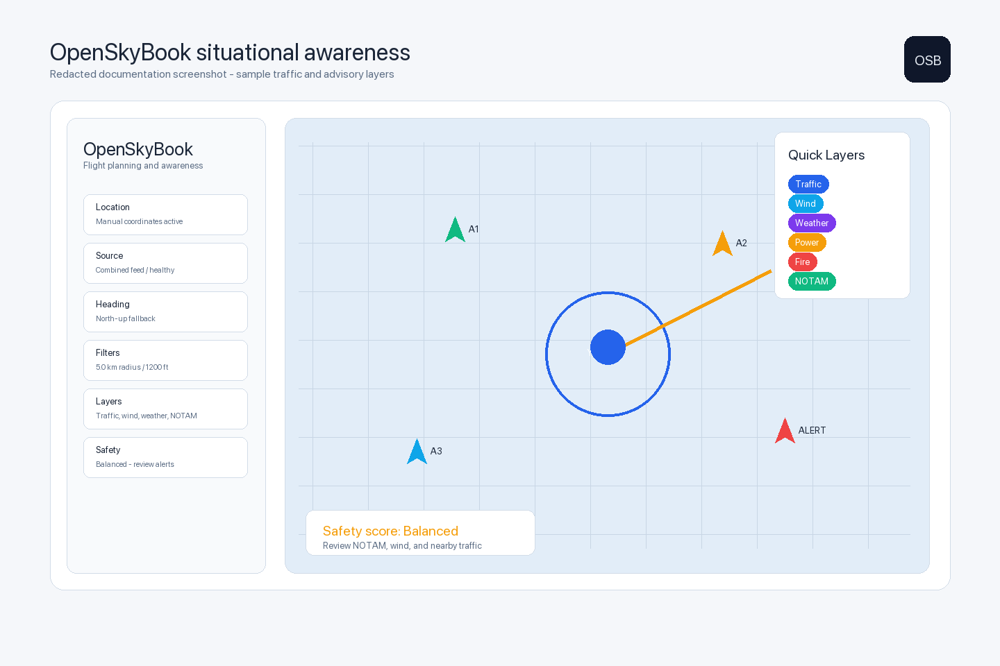
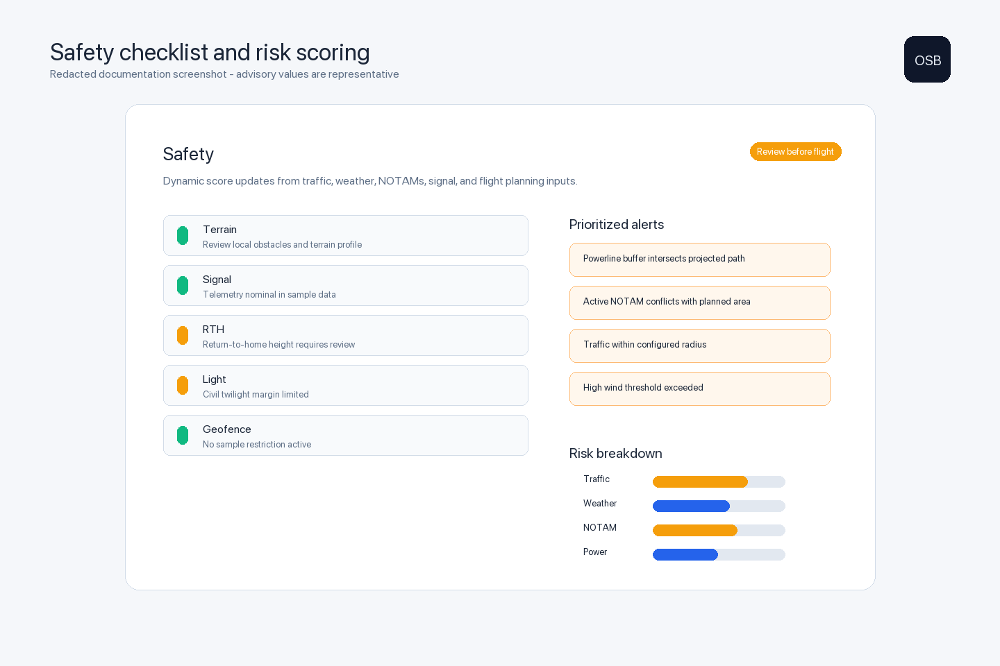
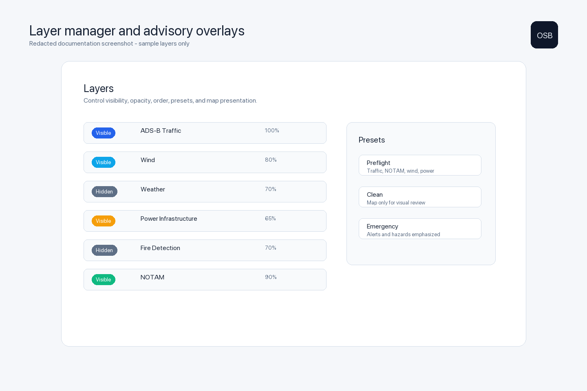
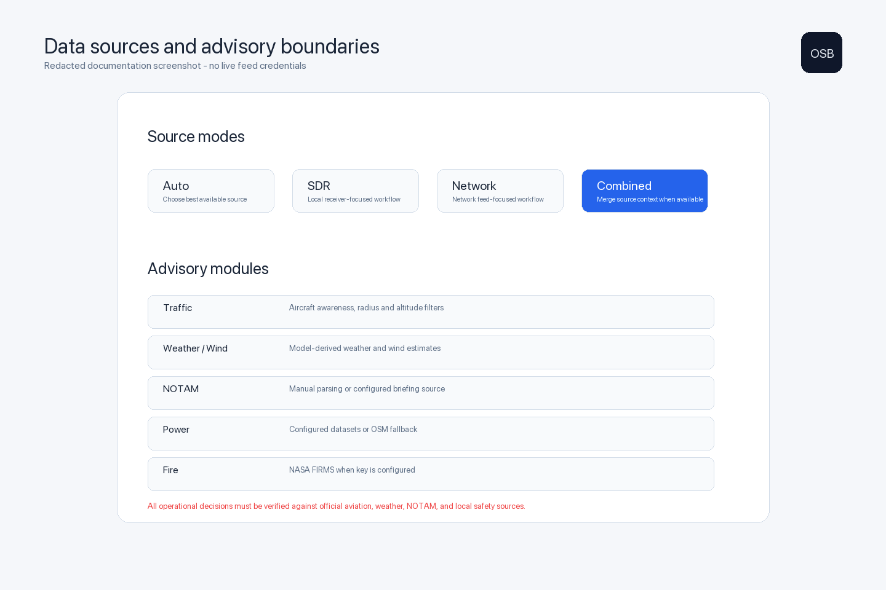

# OpenSkyBook

OpenSkyBook is a native macOS situational-awareness and flight-planning toolkit for drone and FPV operators. It brings traffic awareness, advisory map layers, weather/wind context, NOTAM review, powerline awareness, fire detection, and preflight risk scoring into one operational planning surface.

It is designed as an advisory field tool, not an official aviation source or a replacement for pilot judgment.



## Highlights

- Native macOS SwiftUI map interface.
- Device GPS or manual-coordinate location workflow.
- North-up and heading-up map orientation modes.
- ADS-B / aircraft-awareness presentation with alert radius and altitude filters.
- SDR, network, automatic, and combined source preference modes.
- Layer manager with map style, presets, visibility, opacity, ordering, and clean mode.
- Quick layer controls for traffic, wind, weather, power, fire, and NOTAM overlays.
- Wind and weather advisory panels.
- Manual and configurable NOTAM parsing workflow.
- Powerline and power-structure advisory layer.
- NASA FIRMS fire-detection support when configured.
- Safety checklist with dynamic risk factors and prioritized alerts.
- Audio and voice alert controls for traffic and advisory layers.

## Screenshots

| Situational awareness | Safety scoring |
| --- | --- |
|  |  |

| Layer manager | Source boundaries |
| --- | --- |
|  |  |

Screenshots are redacted documentation images. They use representative sample data and do not expose live user location, private feed credentials, or operational field notes.

More detail is available in [docs/SCREENSHOTS.md](docs/SCREENSHOTS.md).

## What OpenSkyBook Helps With

- Preflight area review before a drone or FPV session.
- Nearby aircraft awareness and configurable traffic alerts.
- Advisory review of wind, weather, NOTAMs, power infrastructure, and fire detections.
- Layered map planning for field operations.
- Flight-readiness review through a structured checklist.
- Field decision support when multiple weak signals need to be considered together.

## Important Safety Boundary

OpenSkyBook is for planning assistance only.

Always verify operational decisions against official sources, including aviation authorities, NOTAM providers, weather services, airspace tools, local restrictions, emergency services, land managers, and on-site observations.

The app does not authorize flight, guarantee airspace status, guarantee obstacle clearance, or replace legal compliance.

See [docs/SAFETY.md](docs/SAFETY.md).

## Data Sources And Configuration

OpenSkyBook includes support for several advisory inputs:

- Aircraft traffic from selected source modes.
- Weather and wind estimates from atmospheric data.
- NOTAM text pasted manually or fetched from a configured source.
- Power infrastructure from configured datasets or fallback providers.
- Fire detections through NASA FIRMS when `FIRMS_MAP_KEY` is configured.

Some features require local configuration or external keys. If a provider is not configured, OpenSkyBook keeps the workflow usable with manual review, status messages, or preview/fallback data.

## Related FPV-dB Project

DroneSite is a related FPV-dB project for drone operations, field notes, and site intelligence.

Repository URL: [https://github.com/FPV-dB/dronesite](https://github.com/FPV-dB/dronesite)

DroneSite is not currently a public repository, so the URL may require access.

## Requirements

- macOS with SwiftUI and MapKit support.
- Xcode with the macOS SDK.
- Location permission if using device GPS.
- Network access for configured online advisory providers.

## Build

From the repository root:

```bash
DEVELOPER_DIR=/Applications/Xcode.app/Contents/Developer \
xcodebuild -project OpenSkyBook.xcodeproj \
  -scheme OpenSkyBook \
  -configuration Debug \
  -derivedDataPath build/DerivedData \
  build
```

Run the built debug app:

```bash
open build/DerivedData/Build/Products/Debug/OpenSkyBook.app
```

## Documentation

- [User Guide](docs/USER_GUIDE.md)
- [Safety Notes](docs/SAFETY.md)
- [Privacy Notes](docs/PRIVACY.md)
- [Screenshot Index](docs/SCREENSHOTS.md)

## Project Structure

```text
OpenSkyBook/
  OpenSkyBook.xcodeproj
  OpenSkyBook/
    AircraftAwarenessModel.swift
    ContentView.swift
    OpenSkyBookApp.swift
    Assets.xcassets
  docs/
    screenshots/
```

## Status

OpenSkyBook is evolving as an FPV-dB field-awareness and planning tool. Current work emphasizes professional documentation, clearer advisory boundaries, and practical workflows for drone and FPV operators.

## Credits

Created by **FPV-dB**.

## Hire / Contact

FPV-dB is available for hire for macOS, SwiftUI, RF tooling, drone software, mapping, and field-operations utilities. For work enquiries, contact ex.dee.emm@gmail.com.
